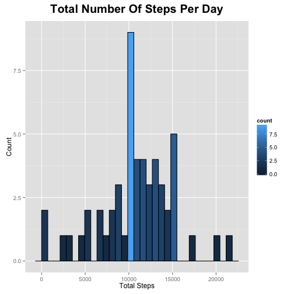
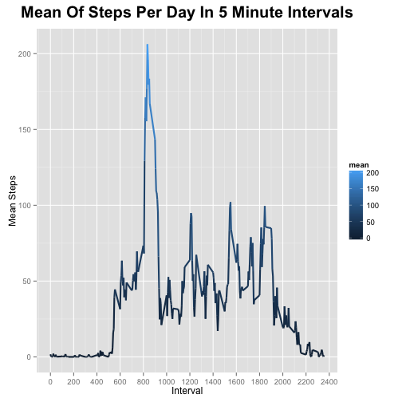
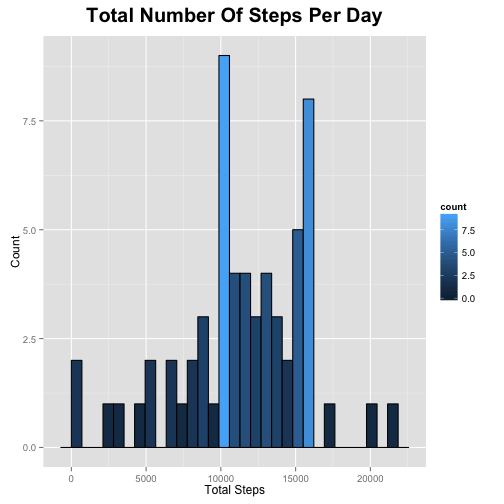
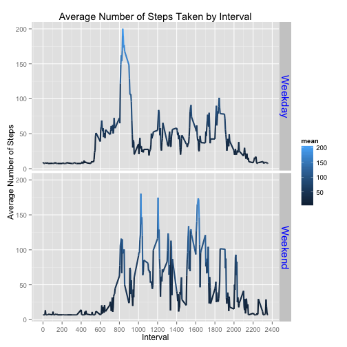

Reproducible Research: Peer Assessment 1
========================================

Author: Donald Mackert

This assignment was forked from https://github.com/rdpeng/RepData_PeerAssessment1

##Introduction and purpose

It is now possible to collect a large amount of data about personal movement using activity monitoring devices such as a Fitbit, Nike Fuelband, or Jawbone Up. These type of devices are part of the “quantified self” movement – a group of enthusiasts who take measurements about themselves regularly to improve their health, to find patterns in their behavior, or because they are tech geeks. But these data remain under-utilized both because the raw data are hard to obtain and there is a lack of statistical methods and software for processing and interpreting the data.

This assignment makes use of data from a personal activity monitoring device. This device collects data at 5 minute intervals through out the day. The data consists of two months of data from an anonymous individual collected during the months of October and November, 2012 and include the number of steps taken in 5 minute intervals each day.

Note: The verbose approach to this mark down file is deliberate to facilitate learning vice the most efficient means to write the code

## Data Set Acquisiton

The set was acquired from https://d396qusza40orc.cloudfront.net/repdata%2Fdata%2Factivity.zip

## Setting up the environment

The dplyr library is utilized for the analysis and ggplot2 for the plots of the data


```r
require(dplyr)
require(ggplot2)
```

## Loading and preprocessing the data

The data file is manually unzipped within the current working directory of R and is named activity.csv
The data file is loaded into a data.frame named activityData utilizing the read.table function wrapped in a function called loadfile


```r
loadfile <- function(directoryPath, filePath, colSep) {
      
      ## Form the path; handle the data file is in the same directory as the working directory
      
      if (directoryPath == "" ) {
            
            path <- file.path(filePath)
            
      } else {
            
            path <- file.path(directoryPath, filePath)
            
      }
      
      ## Get the data as data.frame
      
      data <- read.table(path, header = TRUE, stringsAsFactors = FALSE, sep = colSep)
      
      return(data)
      
} ## end loadfile function

## Set the file names and directories for each of the data files

# Current Directory

baseDirectory <- ""

# Data Set File Name

dataSetFile <- "activity.csv"

# Load the data file

activityData <- loadfile(baseDirectory, dataSetFile, ",")
```

# Explore the data

Once the data is loaded it explored utilizing the str(), head(), and names() functions. These functions show the number of rows, variables, and column names of the data set as well as the fact there is NA data in a minimum of the steps column.


```r
str(activityData)
```

```
## 'data.frame':	17568 obs. of  3 variables:
##  $ steps   : int  NA NA NA NA NA NA NA NA NA NA ...
##  $ date    : chr  "2012-10-01" "2012-10-01" "2012-10-01" "2012-10-01" ...
##  $ interval: int  0 5 10 15 20 25 30 35 40 45 ...
```


```r
head(activityData)
```

```
##   steps       date interval
## 1    NA 2012-10-01        0
## 2    NA 2012-10-01        5
## 3    NA 2012-10-01       10
## 4    NA 2012-10-01       15
## 5    NA 2012-10-01       20
## 6    NA 2012-10-01       25
```


```r
names(activityData)
```

```
## [1] "steps"    "date"     "interval"
```

# Part 1 - What is mean total number of steps taken per day?

This section asks three specific questions:

      1. Calculate the total number of steps taken per day
      2. Make a histogram of the total number of steps taken each day
      3. Calculate and report the mean and median of the total number of steps taken per day
      
      Note: For this part of the assignment, you can ignore the missing values in the dataset.

## Data preparation for Part 1

To answer the two of the three question the rows with the steps set to NA are removed (activityNoNA variable) and the data is grouped by date (groupByDate variable). 


```r
# Remove the NA Data

activityNoNA <- activityData %>% filter(complete.cases(activityData))

# Group the data by date

groupByDate <- group_by(activityNoNA, date)
```

The sum and the mean of the number of steps taken per day are calculated and stored in the partOneSummary variable.  The column names are relabeled to meaningful names.


```r
# Summarise the data with steps set to 0

partOneSummary <- summarise(groupByDate, sum(steps), mean(steps))

# Relabel the columns

colnames(partOneSummary) <- c('date', 'sum', 'mean')
```

### To answer the first question the summary data shows the sum and mean of each day with the NA's removed


```r
print(partOneSummary)
```

```
## Source: local data frame [53 x 3]
## 
##          date   sum     mean
## 1  2012-10-02   126  0.43750
## 2  2012-10-03 11352 39.41667
## 3  2012-10-04 12116 42.06944
## 4  2012-10-05 13294 46.15972
## 5  2012-10-06 15420 53.54167
## 6  2012-10-07 11015 38.24653
## 7  2012-10-09 12811 44.48264
## 8  2012-10-10  9900 34.37500
## 9  2012-10-11 10304 35.77778
## 10 2012-10-12 17382 60.35417
## ..        ...   ...      ...
```

### The second question requires a histogram of the total steps taken per day


```r
# Create a histgrom

plot <- ggplot(data = partOneSummary, aes(sum)) + 
      geom_histogram(col="black", aes(fill=..count..)) +
      labs(title = "Total Number Of Steps Per Day") +
      labs(x = "Total Steps", y = "Count") +
      theme(plot.title = element_text(size=20, face="bold", vjust=2)) 

print(plot)
```

 

### The third question in part on requires the mean and the median ofthe total number steps taken per day.

All steps with the value of 0 were removed to calculate the median since with majority of median functions within R 0 values caused the median to returned as 0.  The sum, mean, median, min, and max values were included to understand the data set.  The only variance in the values were the mean since by removing the 0 step rows resulted in a different count to calculate the mean.


```r
# Remove all steps = 0

groupByDateNoZeros <- filter(groupByDate, steps > 0)

# Summarise the data with NA and 0 steps removed

partOneMedian <- summarise(groupByDateNoZeros, sum(steps), mean(steps), median(steps), min(steps), max(steps))

colnames(partOneMedian) <- c('date', 'sum', 'mean', 'median', 'min', 'max')

print(partOneMedian)
```

```
## Source: local data frame [53 x 6]
## 
##          date   sum      mean median min max
## 1  2012-10-02   126  63.00000   63.0   9 117
## 2  2012-10-03 11352 140.14815   61.0   4 613
## 3  2012-10-04 12116 121.16000   56.5   1 547
## 4  2012-10-05 13294 154.58140   66.0   2 555
## 5  2012-10-06 15420 145.47170   67.0   4 526
## 6  2012-10-07 11015 101.99074   52.5   7 523
## 7  2012-10-09 12811 134.85263   48.0   3 748
## 8  2012-10-10  9900  95.19231   56.5   7 413
## 9  2012-10-11 10304 137.38667   35.0   4 748
## 10 2012-10-12 17382 156.59459   46.0   2 802
## ..        ...   ...       ...    ... ... ...
```

# Part 2 - What is the average daily activity pattern?

This section asks two specific questions:

      1. Make a time series plot (i.e. type = "l") of the 5-minute interval (x-axis) and the average number of steps taken, averaged across all days (y-axis)
      2. Which 5-minute interval, on average across all the days in the dataset, contains the maximum number of steps?

## Data preparation for Part 2

The data is grouped by interval using the activityNoNA data.frame and the mean is calculated.


```r
groupByInterval <- group_by(activityNoNA, interval)

partTwoMean <- summarise(groupByInterval, mean(steps))

colnames(partTwoMean) <- c('interval', 'mean')
```

### The first question of Part 2 requires a time series plot of the average number of steps taken, averaged across all days


```r
plot2 = ggplot(data = partTwoMean, aes(x = interval, y = mean, color = mean)) + 
      geom_line(size = 1) +
      scale_x_continuous(breaks = pretty(partTwoMean$interval, n = 10)) +
      labs(title = "Mean Of Steps Per Day In 5 Minute Intervals") +
      labs(x = "Interval", y = "Mean Steps") +
      theme(plot.title = element_text(size=20, face="bold", vjust=2)) 

print(plot2)
```

 

### The second question of Part 2 asks which 5 minute interval has the maximum number of steps


```r
# Get the 5 minute interval with maximum average steps

maxInterval <- top_n(partTwoMean, n = 1)

print(maxInterval)
```

```
## Source: local data frame [1 x 2]
## 
##   interval     mean
## 1      835 206.1698
```

# Part 3 - Imputing missing values

This section has seven questions or requirements:

      1. Calculate and report the total number of missing values in the dataset.
      2. Devise a strategy for filling in all of the missing values in the dataset.
      3. Create a new dataset that is equal to the original dataset but with the missing data filled in.
      4. Make a histogram of the total number of steps taken each day.
      5. Calculate and report the mean and median total number of steps taken per day
      6. Do these values differ from the estimates from the first part of the assignment?
      7. What is the impact of imputing missing data on the estimates of the total daily number of steps?

### The first requirement of Part 3 requires the total number of missing values in the data set.  

Using the original data.frame variable activityData with no NA values removed we can ascertain that there are 2304 missing values in the data set. The interval and date columns of the activityData set were test for NA values.


```r
# Calculate the number of rows with NA values

naRowCount <- nrow(filter(activityData, is.na(steps)))
print(naRowCount)
```

```
## [1] 2304
```

```r
any(is.na(activityData$date))
```

```
## [1] FALSE
```

```r
any(is.na(activityData$interval))
```

```
## [1] FALSE
```

### The second and third requirement of Part 3 requires a strategy to replace the NA values in the steps portion of the data set and create a new data set with the values filled in.  The new data.frame is activityNAReplaced.

The approach selected is to replace the NA values with the median of all steps in the data set which is 56.


```r
# Replace the NA values with the median of the entire data set (steps)

activityNAReplaced <- mutate(activityData, steps = replace(steps, is.na(steps), median(groupByDateNoZeros$steps, na.rm = TRUE)))
```

### Data preparation for the fourth requirement of Part 3.

The data is grouped by date.


```r
groupByDateNAReplaced <- group_by(activityNAReplaced, date)
```

The data is summarized by calculating the sum, mean, and the min and max steps.


```r
part3Summary <- summarise(groupByDateNAReplaced, sum(steps), mean(steps), min(steps), max(steps))

colnames(part3Summary) <- c('date', 'sum', 'mean', 'min', 'max')

print(part3Summary)
```

```
## Source: local data frame [61 x 5]
## 
##          date   sum     mean min max
## 1  2012-10-01 16128 56.00000  56  56
## 2  2012-10-02   126  0.43750   0 117
## 3  2012-10-03 11352 39.41667   0 613
## 4  2012-10-04 12116 42.06944   0 547
## 5  2012-10-05 13294 46.15972   0 555
## 6  2012-10-06 15420 53.54167   0 526
## 7  2012-10-07 11015 38.24653   0 523
## 8  2012-10-08 16128 56.00000  56  56
## 9  2012-10-09 12811 44.48264   0 748
## 10 2012-10-10  9900 34.37500   0 413
## ..        ...   ...      ... ... ...
```

### The fourth requirement of Part 3 is to create a histogram of the total number of steps each day.


```r
plot3 <- ggplot(data = part3Summary, aes(sum)) + 
      geom_histogram(col="black", aes(fill=..count..)) +
      labs(title = "Total Number Of Steps Per Day") +
      labs(x = "Total Steps", y = "Count") +
      theme(plot.title = element_text(size=20, face="bold", vjust=2)) 

print(plot3)
```

 

### The fifth requirement is to calculate the mean and the median of the steps each day.

To calculate the median all 0 values were removed.  All steps with the value of 0 were removed to calculate the median since with majority of median functions within R 0 values caused the median to returned as 0.  The sum, mean, median, min, and max values were included to understand the data set.  The only variance in the values were the mean since by removing the 0 step rows resulted in a different count to calculate the mean.

Refer to the data preparation section for the fourth requirement of Part 3 for the mean and here for the median.

Note: A new data set can be created for presentation purposes.


```r
# Calculate the median

groupByDateNAReplacedNo0 <- filter(groupByDateNAReplaced, steps > 0)

part3MedianSummary <- summarise(groupByDateNAReplacedNo0, sum(steps), median(steps), min(steps), max(steps))

print(part3MedianSummary)
```

```
## Source: local data frame [61 x 5]
## 
##          date sum(steps) median(steps) min(steps) max(steps)
## 1  2012-10-01      16128          56.0         56         56
## 2  2012-10-02        126          63.0          9        117
## 3  2012-10-03      11352          61.0          4        613
## 4  2012-10-04      12116          56.5          1        547
## 5  2012-10-05      13294          66.0          2        555
## 6  2012-10-06      15420          67.0          4        526
## 7  2012-10-07      11015          52.5          7        523
## 8  2012-10-08      16128          56.0         56         56
## 9  2012-10-09      12811          48.0          3        748
## 10 2012-10-10       9900          56.5          7        413
## ..        ...        ...           ...        ...        ...
```

### The sixth requirement is determine if the values differ with the NA values filled in.

The answer is yes by looking at the first three rows of the data with the NA values removed versus the data with the NA values filled in.


```r
head(partOneSummary, n = 3)
```

```
## Source: local data frame [3 x 3]
## 
##         date   sum     mean
## 1 2012-10-02   126  0.43750
## 2 2012-10-03 11352 39.41667
## 3 2012-10-04 12116 42.06944
```

```r
head(part3Summary, n = 3)
```

```
## Source: local data frame [3 x 5]
## 
##         date   sum     mean min max
## 1 2012-10-01 16128 56.00000  56  56
## 2 2012-10-02   126  0.43750   0 117
## 3 2012-10-03 11352 39.41667   0 613
```

Note the in the first data set with NA removed 2012-10-01 has no entry since all values were NA.  Note the change in the mean for 2012-10-02 and 2012-10-03 with the introduction of the median (56) to the NA rows.

### The seventh requirement is to determine the impact of imputing the NA values.

The primary impact is that 2304 missing values were replaced with the median of all steps (56).  This results in 2304 rows being reintroduced to the data set which in turn affects the sum of steps and the mean of the steps based on the current questions.

# Part 4 - Are there differences in activity patterns between weekdays and weekends?

This section has two requirements:

      Note: Use the dataset with the filled-in missing values for this part.

      1. Create a new factor variable in the dataset with two levels – “weekday” and “weekend” indicating whether a given date is a weekday or weekend day.
      2. Make a panel plot containing a time series plot (i.e. type = "l") of the 5-minute interval (x-axis) and the average number of steps taken, averaged across all weekday days or weekend days (y-axis)
      
### The first requirement requires a new factor variable for the weekday and weekend.

This is created by testing each date in the groupByDateNAReplaced data.frame using the weekday function for the type of day (weekday or weekend) and adding a column to the data.frame called dayType.


```r
groupByDateNAReplaced$dayType <- ifelse(weekdays(as.Date(groupByDateNAReplaced$date)) %in% c("Satuday", "Sunday"), "Weekend", "Weekday")
```

### Data preparation for the second requirement of Part 4.

The data is grouped by interval and day type and stored in a data.frame called groupByIntervalDays.  The sum, mean, min, and max steps are calculated to create the plot.


```r
groupByIntervalDays <- group_by(groupByDateNAReplaced, interval, dayType)

part5Summary <- summarise(groupByIntervalDays, sum(steps), mean(steps), min(steps), max(steps))

colnames(part5Summary) <- c('interval', 'dayType', "sum", 'mean', 'min', 'max')
```

### The second requirement of Part 4 requires a time series plot showing the differences between the weekdays and the weekends

One interesting trend shown in the plot is that activity on the weekend typically starts around 0800 in the morning or 1000.  There is more activity during the day on the weekend versus the weekday which may be a result of work versus leisure time.  In the weekday panel there is a spike in activity from 0800 - 1000 which may indicate a combination of exercise or other activity combined with going to work. This spike is not reflect in the 1600 - 1800 time frame which may indicate only movement to and from work.


```r
plot4 <- ggplot(data = part5Summary, mapping = aes(x = interval, y = mean, color = mean)) + 
      geom_line(size = 1) + 
      facet_grid(dayType ~ .) + 
      scale_x_continuous(breaks = pretty(partTwoMean$interval, n = 10)) + 
      labs(x = "Interval", y = "Average Number of Steps") +
      labs(title = "Average Number of Steps Taken by Interval") +
      theme(strip.text.y = element_text(size = 15, colour = "blue"))

print(plot4)
```

 
